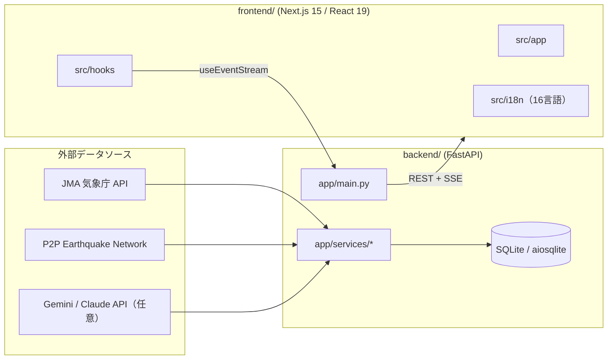

# アーキテクチャ (Architecture)

Japan Disaster Alert は、Python/FastAPI バックエンドと Next.js フロントエンドからなる
2 層構成の Web アプリケーションです。気象庁（JMA）と P2P 地震情報ネットワークの
外部データを取得・正規化し、SSE で 16 言語のクライアントへリアルタイム配信します。

## 全体像 (Overview)

## コンポーネント (Components)

### バックエンド (`backend/`)

| パス | 役割 |
|------|------|
| `app/main.py` | FastAPI アプリのエントリポイント、ルーティング、ミドルウェア |
| `app/models.py` | Pydantic データモデル |
| `app/config.py` | `pydantic-settings` による環境変数ベース設定 |
| `app/exceptions.py` | カスタム例外クラス |
| `app/database.py` | 非同期 SQLAlchemy エンジン / セッション |
| `app/db_models.py` | SQLAlchemy テーブル定義 |
| `app/services/jma_service.py` | JMA 気象 API 連携 |
| `app/services/p2p_service.py` | P2P 地震 API 連携 |
| `app/services/event_manager.py` | SSE イベント管理・ブロードキャスト（10 秒ポーリング、ID 差分検出、30 秒ハートビート） |
| `app/services/translator.py` | 翻訳サービスのファサード |
| `app/services/ai_provider.py` | AI API 連携（Gemini / Claude） |
| `app/services/translation_cache.py` | 翻訳キャッシュ（L1 メモリ + L2 DB） |
| `app/services/translation_templates.py` | 静的な多言語テンプレート |
| `app/services/location_translations.py` | 地名の静的翻訳（75 地名 × 15 言語） |
| `app/services/safety_guide.py` | AI 安全ガイド生成 |
| `app/services/shelter_service.py` | 避難所検索（CSV / JSON） |
| `app/services/push_service.py` | Web Push + 地域セグメント通知（DB バック） |
| `app/services/tsunami_service.py` / `volcano_service.py` / `warning_service.py` | 津波・火山・警報集約 |
| `app/utils/area_codes.py` | JMA エリアコードマッピング |
| `app/utils/error_handler.py` | 統一エラーハンドリング |
| `app/utils/logger.py` | 構造化 JSON ログ（本番）/ プレーンテキスト（開発） |
| `backend/tests/` | pytest テスト（38 件） |
| `backend/run.py` | 開発用 Uvicorn 起動スクリプト（`0.0.0.0:8000`、reload 有効） |

### フロントエンド (`frontend/`)

| パス | 役割 |
|------|------|
| `src/app/` | Next.js App Router ページ |
| `src/components/` | React コンポーネント（`__tests__/` に Vitest ユニットテスト） |
| `src/hooks/` | カスタムフック（`useEventStream`, `useTheme`, `usePushNotification`） |
| `src/config/` | API 接続設定 |
| `src/i18n/` | 16 言語の翻訳文字列（`translations.ts`: `getTranslation()` ほか） |
| `src/types/` | TypeScript 型定義（`earthquake.ts` など共有型） |
| `e2e/` | Playwright E2E テスト（28 件） |
| `public/sw.js` | Service Worker（v2、オフライン対応） |
| `public/manifest.json` / `public/icons/` | PWA マニフェスト・アイコン |

## データフロー (Data Flow)

1. **取得**: `jma_service` / `p2p_service` が `httpx` で外部 API を非同期取得する。
2. **正規化**: 取得データを Pydantic モデル（`app/models.py`）へ変換し、`area_codes` でエリアを解決する。
3. **翻訳**: `translator` がハイブリッド方式で文字列を翻訳する。
   静的辞書（`location_translations` / `translation_templates`）→ AI 翻訳（`ai_provider`、任意）→ キャッシュ（`translation_cache`、L1 メモリ + L2 DB）。
4. **配信**: `event_manager` が 10 秒間隔でポーリングし、ID 差分があれば SSE（`/api/v1/events/stream`）で接続中クライアントへ配信する。30 秒ごとにハートビートを送出し、`MAX_SSE_CLIENTS=500` で過負荷を防ぐ。
5. **受信**: フロントエンドの `useEventStream` フックが SSE を購読する。切断時は指数バックオフで再接続し、失敗時はポーリングへフォールバックする。
6. **通知**: `push_service` が VAPID Web Push を送信。47 都道府県コードと震度しきい値で対象を地域セグメントする。

## 技術選定の理由 (Tech Choices)

- **FastAPI + 非同期 SQLAlchemy / aiosqlite**: 外部 API への並行 I/O を活かすため全層を非同期化。既定は SQLite だが PostgreSQL へ移行可能な構成。
- **SSE（ポーリングフォールバック付き）**: WebSocket より軽量な一方向リアルタイム配信。プロキシ越しでも安定し、ポーリングへ degrade できる。
- **ハイブリッド翻訳**: AI コスト・レイテンシを抑えるため、まず静的辞書とキャッシュで解決し、未知文字列のみ AI へフォールバック。AI キー未設定でも動作する。
- **slowapi レート制限 + 1MB サイズ制限**: 公開データソースを保護し、DoS / URL インジェクションを防御。
- **Next.js 15 / React 19 + PWA**: モバイルでのインストール・オフライン対応と、訪日観光客向けの多言語 UI を両立。

詳細な意思決定の経緯は [plan.md](../../plan.md) の「決定事項ログ」を参照してください。
